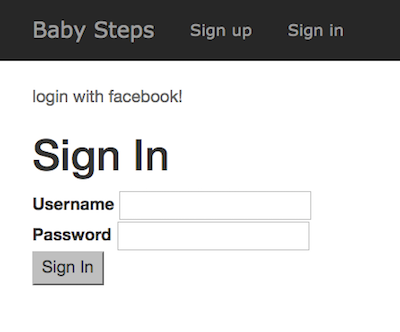
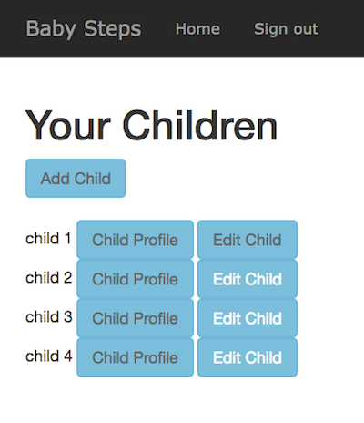

# Baby_Steps
<table>
<tr>
<td>
  Ruby on Rails application for Flatiron Rails Portfolio Project. Builds a basic content management system that keeps track of the skills your baby has achieved. It allows for comments to be saved on each skill and a user can have more than one child. It helps a parent keep track of the learned skills.
</td>
</tr>
</table>

### Signing In

### Multiple Children


### Installing

Clone or Download Baby_Steps

Go to the corresponding directory, Example code:

```
cd downloads/baby_steps-master
```

Now type bundle install in your terminal

```
bundle install
```

IMPORTANT, If you want to use the facebook login. Follow the steps below. Do these steps before proceeding to get facebook log in to work. If you don't want the facebook login to work got to the Set Up the Database section.

A Facebook App Id and App Secret will be needed. Got to Facebook for Developers(https://developers.facebook.com/) to do the following

- Set Up the App on Facebook
- Log in, then you will see the option to Add a New App under My Apps.
- Get the APP ID and APP SECRET

Type in the Display name for the app. Example  Baby Steps.
Go to the dashboard to look for the two things we need.
APP ID and APP SECRET.

Please note to keep these two keys in a separate file. Do not commit.
Now that you have the two numbers.

- Go to your terminal. These two numbers will be exported using the terminal. Put in your corresponding keys instead of the Xs.

```
FACEBOOK_APP_ID=xxxxxxxxx
FACEBOOK_APP_SECRET=xxxxxxxx
```
Please Note:
The Rails Server needs to be run on the same terminal window where you exported the keys.

### Set Up the Database

In the terminal

`rake db:setup`

If you have Rails 5.1.1  command
`rails db:setup ``
will also work

### Run Rails Server
`rails s`

Open App
Opening app in browser
Open url http://localhost:3000 in your browser.

This is the default server for most, but if you have issues check the link given after you run rails s.

### Bug / Feature Request

Bugs. If you find a bug, kindly open an issue [here](https://github.com/latinadeveloper/baby_steps/issues) by including your search query and the expected result.

If you'd like to request a new function, feel free to do so by opening an issue [here](https://github.com/latinadeveloper/baby_steps/issues). Please include sample queries and the corresponding results of the functions you would like to see.


### Contributing
Want to contribute?
To fix a bug or enhance an existing module, follow these steps:
- Fork the repo
- Create a new branch (`git checkout -b improve-feature`)
- Make the appropriate changes in the files
- Add changes to reflect the changes made
- Commit your changes (`git commit -a -m 'improve-feature'`)
- Push to the branch (`git push origin improve-feature`)
- Create a Pull Request


## [License](https://github.com/latinadeveloper/baby_steps/license.md)

This project is licensed under the MIT License © [Isis Tejeda ](https://github.com/latinadeveloper)
